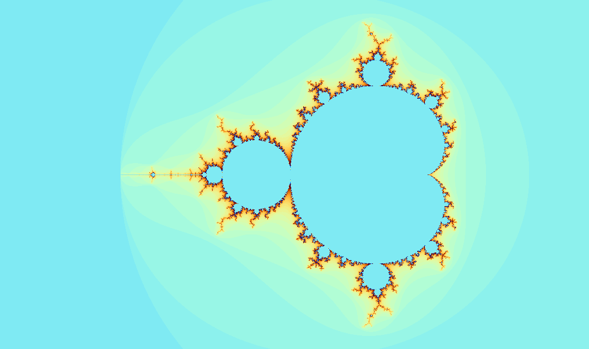

# Mandelbrot Fractal

My experiments with the Mandelbrot fractal. 

# Compile & Run

You need a C++20 compatible compiler

```bash
$ mkdir build
$ cd build
$ cmake .. && make
$ ./Mandelbrot
```

# Screenshot


